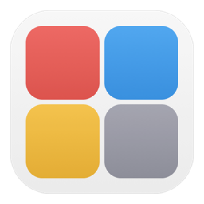

<p align="center">
  
</p>

<h1 align="center">Q Box</h1>

<p align="center">
  macOS 四象限任务管理工具 · Eisenhower Matrix Task Manager for macOS
</p>

<p align="center">
  
  
  
</p>

---

## 简介 | About

**Q Box** 是一款 macOS 原生桌面应用，基于艾森豪威尔矩阵（四象限工作法）帮助你每天按**重要性**和**紧急度**规划工作任务。

**Q Box** is a native macOS desktop app based on the Eisenhower Matrix, helping you organize daily tasks by **importance** and **urgency**.

## 功能 | Features

| 功能 | Feature | 说明 |
|------|---------|------|
| 四象限面板 | Four Quadrants | 毛玻璃效果，拖拽移动任务 / Frosted glass panels with drag & drop |
| 截止时间 | Deadlines | 所有入口支持设置 DDL / Set deadlines from any entry point |
| 时间线 | Timeline | 8:00-22:00 彩色时间条 / Color-coded daily timeline |
| 专注模式 | Focus Mode | 双击象限标题放大 / Double-click to enlarge a quadrant |
| 番茄钟 | Pomodoro | 25/5 计时，系统通知 / 25min work + 5min break with notifications |
| 菜单栏 | Menu Bar | 快速添加、进度概览 / Quick add & progress overview |
| 历史迁移 | Migration | 自动检测未完成任务 / Auto-detect incomplete tasks from past days |
| AI 规划 | AI Planning | `/daily` skill 智能安排任务 / Claude Code skill for task planning |

## 安装 | Installation

### 从源码构建 | Build from Source

```bash
git clone https://github.com/FromCSUZhou/q-box.git
cd q-box/QuadrantApp
./build.sh
open "Q Box.app"
```

### 安装到 Applications

```bash
cp -r "Q Box.app" /Applications/
```

> 首次打开如遇安全提示，运行：`xattr -cr /Applications/Q\ Box.app`

## 使用 | Usage

### 基本操作 | Basic Operations

- **添加任务**: 点击象限左下角 `+` 或按 `⌘N` 快速添加
- **编辑任务**: 双击任务文本
- **完成任务**: 点击左侧勾选框
- **移动任务**: 拖拽到其他象限，或右键选择目标象限
- **删除任务**: 右键菜单 → 删除
- **专注模式**: 双击象限标题放大，`ESC` 退出

### AI 规划 | AI Planning (需要 Claude Code)

```bash
# 在项目目录下运行 Claude Code，输入：
/daily
```

AI 会交互式地帮你收集任务、分析优先级、分配象限、安排时间段。

## 数据存储 | Data Storage

任务数据以 JSON 格式存储在：

```
~/Library/Application Support/Q Box/tasks/YYYY-MM-DD.json
```

每天一个文件，可直接编辑或通过 `/daily` skill 生成。

## 技术栈 | Tech Stack

- **SwiftUI** + **AppKit** (NSVisualEffectView, NSWindow)
- **Swift Package Manager**
- macOS 14+ (Sonoma)

## License

MIT

---

<p align="center">Made with ❤️ by <a href="https://github.com/FromCSUZhou">@FromCSUZhou</a></p>
